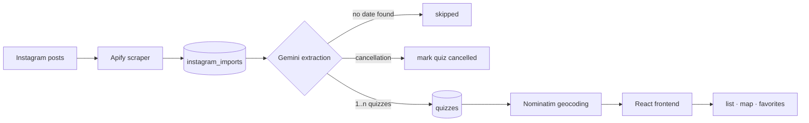
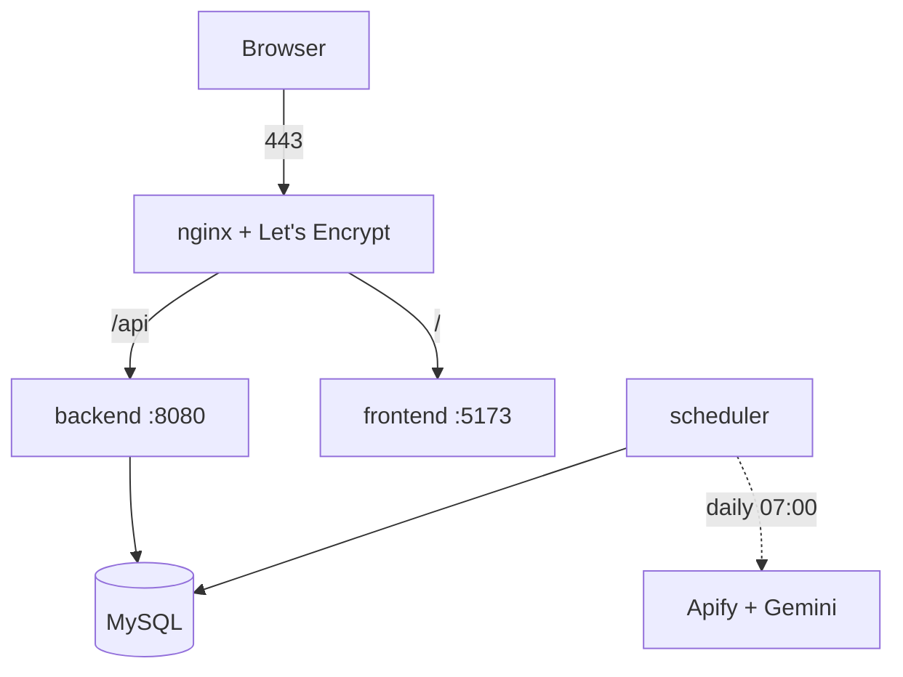

# Ko Zna Zna

A pub quiz aggregator for Serbia, live at [koznazna.me](https://koznazna.me).

Quiz organizers announce their events on Instagram and nowhere else. There is no
feed, no API, no shared calendar. If you want to know what is on this Thursday you
have to open five accounts and read through posts. This project collects those
announcements automatically and turns them into a searchable, filterable listing
with a map.

**Stack:** Laravel 13 (PHP 8.3) · React 19 · TypeScript · MySQL 8 · Docker · Gemini · Apify

---

## What it does



A scheduled job reads recent posts, an LLM turns free text captions into
structured quiz records, addresses get geocoded for the map, and the frontend
serves it. The interesting part is everything that can go wrong in the middle.

---

## The extraction problem

A caption is not a form. The same organizer writes, on different days:

```
GEEKS WHO DRINK, sreda 20:30 i subota 21h, Braće Jugovića 16, karta 500 RSD
```

```
KVIZ REPERTOAR za AVGUST
01.08. Geeks Who Drink
02.08. Supernatural
03.08. Game of Thrones
...30 more lines
```

```
Na današnji dan 1983. Ljubiša Samardžić je dobio nagradu u Rimu
```

The first is one quiz on two dates. The second is a month of different quizzes in
one post. The third is a fun fact that mentions a year and is not a quiz at all.
A fourth kind reposts the original artwork with a pink OTKAZANO band across it,
meaning that evening is cancelled, with nothing in the caption to say so.

Extraction returns a **list** of candidates rather than one record, and the
classification happens in the prompt:

| post type | result |
|---|---|
| single announcement | 1 quiz, with the post artwork and caption |
| monthly schedule | n quizzes, no artwork, no description |
| fun fact or throwback | 0 quizzes, import marked `skipped` |
| cancellation | matching quiz set to `cancelled` |

### Why the schedule gets no artwork

A monthly listing has one cover image and a caption about the whole month. Copying
those onto all 30 entries produced 30 identical cards captioned about other
quizzes. So multi quiz posts create bare records, and when the dedicated post for
that evening appears a day or two later, an enrichment pass fills in **only the
fields that are still empty**. Order does not matter. Schedule first or
announcement first, the specific data wins.

---

## Per organization behaviour without forking the pipeline

Four organizations, four writing styles. Handling that with `if` statements would
mean every new organization risks breaking the existing ones.

```
app/Services/Extraction/
├── ExtractorInterface.php      contract: post -> Quiz[]
├── DefaultExtractor.php        the shared pipeline
└── Orgs/
    └── IHateQuizExtractor.php  overrides two hooks
```

`DefaultExtractor` owns the prompt, the API calls, validation, and the regex
fallback. A subclass overrides at most two hooks:

- `promptRules()` appends organization specific instructions to the shared prompt
- `postProcess()` adjusts candidates before validation

A slug that is not in the registry gets the generic path, so **adding an
organization cannot change how the others are parsed**.

```php
private const EXTRACTORS = [
    'i-hate-quiz' => IHateQuizExtractor::class,
];
```

Values that are stable per organization live in nullable `default_*` columns
rather than in code, and are used only as fallbacks when a caption does not state
them.

---

## Not inventing data

An early version showed every quiz as `2-6 players`. The organizer only ever
states a minimum of 2. The upper bound came from a hardcoded default.

Both columns are nullable now, the prompt says explicitly not to guess, and the
UI renders what is actually known:

| known | shown |
|---|---|
| min and max | `2-6` |
| min only | `2+` |
| neither | field omitted |

The same rule applies to artwork and descriptions. A quiz with no picture of its
own gets a placeholder that reads as "not announced yet", not a borrowed image
from another post.

---

## Deduplication

The same evening is often announced twice, once in the schedule and once in its
own post, worded slightly differently. Two layers:

**Database.** A unique index on `(organization_id, quiz_date, title)`. The
migration collapses pre existing duplicates first, repointing favorites and
imports at the row it keeps.

**Application.** `Quiz::findSimilar()` catches the same event worded differently:

```php
Quiz::normalizeTitle('House of the Dragon')  // "house of dragon"
Quiz::normalizeTitle('House of Dragon')      // "house of dragon"  -> merged
Quiz::normalizeTitle('Estrada')              // "estrada"
Quiz::normalizeTitle('Muzicki kviz')         // "muzicki"          -> kept apart
```

Lowercase, strip diacritics and punctuation, drop filler words, then match on
exact equality or full containment. Deliberately conservative, so two genuinely
different quizzes on one evening stay separate.

---

## Failure modes worth naming

Three bugs that only surfaced in production, all of which failed **silently**.

**A rate limited API call was recorded as "not a quiz".** The scraper returned
nothing, the code marked the import `skipped`, and skipped imports are never
retried. Posts were being lost permanently to a transient error. A dedicated
`ExtractionUnavailableException` now separates "could not reach the model" from
"this post is not a quiz", and leaves such imports pending.

**An unrelated image talked the model out of a schedule.** The vision pass runs
first because organizers often put the quiz name only on the artwork. One post
paired a meme photo with a caption listing 24 dates, and the model classified the
whole thing as a fun fact. An empty vision result is now confirmed by a caption
only pass before the post is dropped.

**A `600` permission on the env file took the whole API down.** Apache in the
container runs as `www-data` while the file is owned by the host user, so it was
unreadable. Laravel does not complain about that. It falls back to framework
defaults, which means SQLite, and every request returned
`Database file at path .../database.sqlite does not exist`. Nothing in that error
points at file permissions, and `artisan` kept working the whole time because
`docker compose exec` runs as root.

---

## Running it locally

Requires Docker Desktop.

```bash
./setup.ps1              # once: generates APP_KEY, creates env files
docker compose up
```

| | |
|---|---|
| Frontend | http://localhost:5173 |
| API | http://localhost:8080/api |
| MySQL | localhost:3306 |

Without `APIFY_TOKEN` and `GEMINI_API_KEY` everything runs, the sync just has
nothing to fetch. Seed four organizations and work from there:

```bash
docker compose exec backend php artisan migrate --seed
```

---

## Commands

```bash
php artisan instagram:sync [--org=slug] [--limit=n]   # scrape and extract
php artisan instagram:test-actor --actor=...          # check a scraper for ~$0.002
php artisan instagram:reprocess-imports --status=...  # re-extract stored posts, no scrape
php artisan quizzes:add-from-caption --org=slug       # create from a pasted caption
php artisan quizzes:prune-unannounced [--dry]         # drop quizzes with no artwork
php artisan geocode:quizzes                           # addresses to coordinates
```

`reprocess-imports` matters more than it looks. Scraping costs money, extraction
does not, so tuning a prompt and re-running it over posts already stored is free.

---

## API

```
GET  /api/quizzes               ?search= &org= &date_from= &date_to= &archive= &subscribed= &page=
GET  /api/quizzes/map
GET  /api/quizzes/{slug}
GET  /api/quizzes/{slug}/calendar.ics
GET  /api/organizations
GET  /api/organizations/{slug}

POST /api/auth/register | login | logout | forgot-password | reset-password
GET  /api/auth/me

GET|POST|DELETE  /api/favorites[/{slug}]
GET              /api/subscriptions
POST|DELETE      /api/organizations/{slug}/subscribe
```

Auth is Laravel Sanctum with bearer tokens. Cancelled quizzes are excluded from
listings but still served by `/quizzes/{slug}`, so a link to one shows "this quiz
was cancelled" instead of a 404.

---

## Deployment



Push to `master` triggers a GitHub Actions deploy: pull, rebuild, migrate, prune
old images. Host and user come from repository secrets, so moving to another
server is a settings change rather than a commit.

`scripts/bootstrap-server.sh` takes a fresh Ubuntu or Oracle Linux host to a
running state: Docker, nginx, certbot, firewall, swap sized to available RAM, and
the nightly database backup. It handles both distribution families because the
free ARM capacity that makes this project cost nothing to host is usually only
available on Oracle Linux images.

### Cost

Runs on an Oracle Cloud Always Free ARM instance. The only running cost is
scraping, on a free tier of $5 a month:

| | per post | 4 orgs daily |
|---|---|---|
| `apify/instagram-scraper` | $0.0026 | $3.74 |
| `apidojo/instagram-scraper` | $0.0005 | $0.72 |

An early version fetched 60 posts per organization per day, which is $18.60 a
month against a $5 budget and exhausted the credit in a week. Scraping depth is
now a scheduled minimum with deeper backfills as an explicit flag.

---

## Repository layout

```
pub-quiz-api/          Laravel
  app/Services/Extraction/   the pipeline described above
  app/Jobs/SyncInstagramPosts.php
  app/Console/Commands/
pub-quiz-ui/           React + Vite
  src/pages/  src/components/  src/lib/
docker/                Dockerfiles, dev and prod
scripts/               server bootstrap, database backup
.github/workflows/     deploy on push to master
```

---

## Things I would do differently

**Backups from day one.** The first production server became unreachable with no
copy of the database anywhere else. Quizzes could be re scraped, user accounts
and favorites could not. A nightly dump was added afterwards, which is the wrong
order.

**A staging environment.** Several bugs were found by deploying and watching, and
two of them were only possible because the server had never been built from
scratch. The scheduler referenced an image no service declared it produced, which
worked purely because that image happened to already exist locally.

**Measuring the API budget before scaling it up.** The cost per call was known and
the arithmetic takes a minute. It was not done until after the credit ran out.
